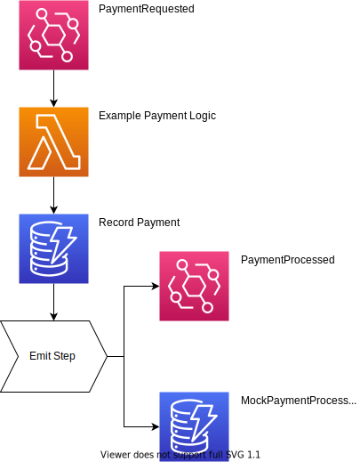

# StepFunction Starter

-   ✅ Basic App
-   ✅ Pipeline
-   ✅ Placeholder Integration Test
-   ✅ Canary Traffic
-   ✅ Dashboard
-   ✅ Alarms on Dashboard Metrics
-   ✅ Gradual deployment
-   ✅ Rollback on Dashboard Metric Alarms

# Example Architecture

The step function can end in 2 ways:

-   emitting an event bridge event
-   writing a mock "event" to a dynamodb table

This depends on whether there is a `synth: true` value on the event payload, representing a `synthetic event`.

This allows us to send test, canary, and load traffic onto this workflow to test this workflow only, and to insure the `paymentProcessed` event does not get emitted to other services.

